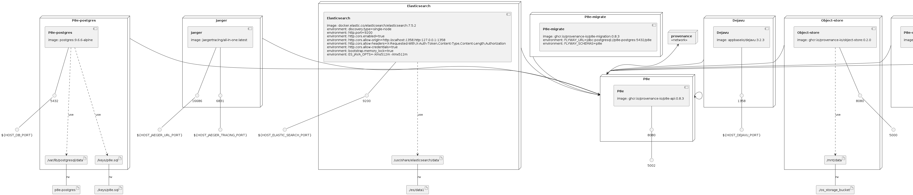

# p8e Development Environment

This repo contains supporting tools for p8e developers that help with the following:

- Cut a local development environment quickly and easily.

NOTE: Increase Docker Resources RAM to at least 2 CPUs and 5GB RAM.

## Prerequisites

Before getting started the following are the required tools you'll need to have installed:

- make
- [go 1.15+](https://golang.org/dl/)

## First time setup

- Brings up all infrastructure and then seeds the p8e database with some useful key pairs.
- Creates a provenance key with a starting sum of hash tokens to allow for tx execution.

```bash
./bin/one-time-setup.sh
```

If this completes successfully, you'll see the final stdout message of `Setup is complete!`. If it fails, it is best to run `./bin/clean` before attempting `./bin/one-time-setup.sh` again.

## Start / stop

Run the following command to bring up all infrastructure that is needed to support local p8e development.

```bash
./bin/update
./bin/start
```

Run the following command to bring down all infrastructure that is needed to support local p8e development.

```bash
./bin/stop
```

### Clean

Run the following command to bring down all infrastructure and also clean all associated artifacts.
This will wipe all state and will require a call to `./bin/one-time-setup.sh` again.

```
./bin/clean
```

## Logs

`docker-compose` can be used to look at all container logs.

## Bootstrapped keys

The setup above will bootstrap and configure p8e with five private keys. The listing of keys can be
found in `env/common/env`. `env/host/env` contains a single private key as well as environment variables
that can be used to connect to the running p8e instance. It is best to source this file in your env.

## Using this environment for contract execution

See [p8e-gradle-plugin](https://github.com/provenance-io/p8e-gradle-plugin) for bootstrapping p8e contracts and runnable examples.
Use `env/host/env` in combination with `p8e-gradle-plugin` to make use of the key pairs that were seeded
with the above scripts.

## Visualizing contract execution

The 'p8e-ui' container hosts a UI that can be used to inspect contract status and contents, as well as the overall flow of contracts through the system. Once all containers are up and running, this can be accessed at http://localhost:3000. Once logged in for the first time, you will need to navigate to the 'Key Management' section of the UI in order to register a (new or existing) key if no keys yet exist in the system. Once there are contracts in the system, you should be able to view contracts and scope data.

## Host port reservations

The following are ports that are forwarded on the host machine:

```
postgres:         5432
elasticsearch:    9200
elasticsearch-ui: 1358

object-store:     5000
p8e:              5002
p8e-webservice:   5003
p8e-ui:           3000
```

Base containers (postgres, etc) can be configured to forward to different host ports. Copy the default
port listing like below and override as needed.

```
cp env/host/ports .host_port_overrides
```

## Notes

`docker-compose ps` uses the docker-compose.yaml to display information and thus will be missing some environment
variables that are needed. Be sure to have those defined in your shell!

```
. bin/source
```


### Infrastructure model

